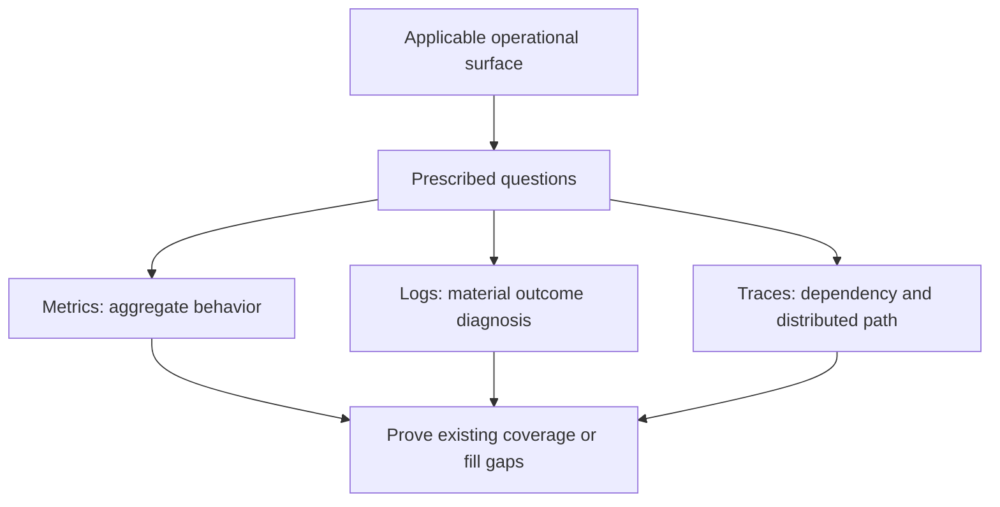

# Lambda Powertools

Start with an operational question. Apply required coverage at applicable boundaries; add the minimum telemetry that fulfills it safely and within budget. Do not scatter Logger + Metrics + Tracer across helpers.

## Coverage before coding

Evaluate all signals together; order here is not implementation priority. Metrics are primary for aggregate monitoring/alerts. Logs and sampled traces cannot replace metric coverage. Required measurements do not imply custom metrics when AWS/application equivalents already exist.

1. Inspect Lambda triggers, dependencies, stages, retries/acks, fallback/resource use, existing emitters, deployment, and Powertools versions. Apply [required surface coverage](references/lambda-surfaces.md) even when the user has no preference.
2. Record each requirement as `managed`, `custom`, `not_applicable`, or `exception`, with question, owner, evidence, semantics and cost. Prove existing equivalence; report gaps with mitigation, owner and review date. Unknown requires assessment, not silent opt-out. Read [signal selection](references/signal-selection.md).
3. Define custom metrics once: fixed name/unit, exactly one purpose (`outcome`, `latency`, `load`, `resource`, `correctness`), population, boundary, statistic/denominator, bounded dimensions, frequency, sampling and budget. Version meaning changes. Read [metrics](references/metrics.md) and [canonical contracts](references/example-contracts.md).
4. Require one safe diagnostic event for each material failure/rejection/degradation/security outcome. Use its category contract, not generic `invalid_input`. Read [logging](references/logging.md), [diagnostic sufficiency](references/diagnostic-sufficiency.md), and [failure taxonomy](references/failure-taxonomy.md).
5. Require tracing of meaningful dependencies and distributed paths. Record enabled/disabled and coverage state; reuse an existing owner, or document non-applicability/exception. Verify activation, permissions, sampling, capture safety and supported handoffs. Read [tracing](references/tracing.md).
6. Extend reusable boundary patterns with Powertools directly. Keep one emission owner, aggregate loops, preserve latency samples, clear warm state and contain telemetry failures. Do not import the root OTel runtime or create a competing logger/framework.
7. Budget metric series + EMF/log volume + trace volume + maintenance. Reduce duplicates/dimensions/publications before exceptions. Read [cost and noise](references/cost-and-noise.md).
8. Apply [review rubric](references/review-rubric.md) and [enforcement](references/enforcement.md). Report covered requirements and unresolved gaps. Do not claim unverified managed equivalence or trace continuity.

## Hard rules

- Never emit raw events/bodies/headers, credentials/tokens, arbitrary exception text/stacks, or sensitive data in logs, trace metadata, or EMF. Use allowlisted bounded diagnostic values.
- No narrative INFO, helper metrics/subsegments, duplicate terminal logs, SDK/manual subsegments, or publication owners.
- Keep exact outcome/resource totals unsampled. A duration total is not a latency distribution. A processed record is not an acknowledged message or unique business event.
- Keep business results/retries intact when telemetry fails; hard timeouts can bypass cleanup. Retain managed platform coverage and verify sustained telemetry loss separately.
- Keep this contract separate from root `cloudwatch-instrumentation`: classic EMF metrics and X-Ray-backed Powertools Tracer, not root OTel/OTLP requirements.

## Load on demand

| Need | Read |
| --- | --- |
| Scope, Sentry preservation and AWS adaptation | [charter](references/charter.md) |
| Required measurements/events/paths | [Lambda surfaces](references/lambda-surfaces.md) |
| Coverage states, equivalence and exceptions | [signal selection](references/signal-selection.md) |
| Metric definitions, lifecycle, publication | [metrics](references/metrics.md), [example contracts](references/example-contracts.md) |
| Safe diagnostic logging | [logging](references/logging.md), [diagnostic sufficiency](references/diagnostic-sufficiency.md), [failure taxonomy](references/failure-taxonomy.md) |
| Dependency/distributed tracing and activation | [tracing](references/tracing.md) |
| Cost, review and checks | [cost/noise](references/cost-and-noise.md), [review](references/review-rubric.md), [enforcement](references/enforcement.md) |
| Request metrics + validation diagnostics; tracing not applicable | [validation-handler.ts](examples/typescript/src/validation-handler.ts) |
| Batch outcome/duration/fallback metrics + terminal diagnostics | [batch-metrics.ts](examples/typescript/src/batch-metrics.ts) |
| Dependency metrics + meaningful trace + terminal diagnostics | [dependency-handler.ts](examples/typescript/src/dependency-handler.ts) |
