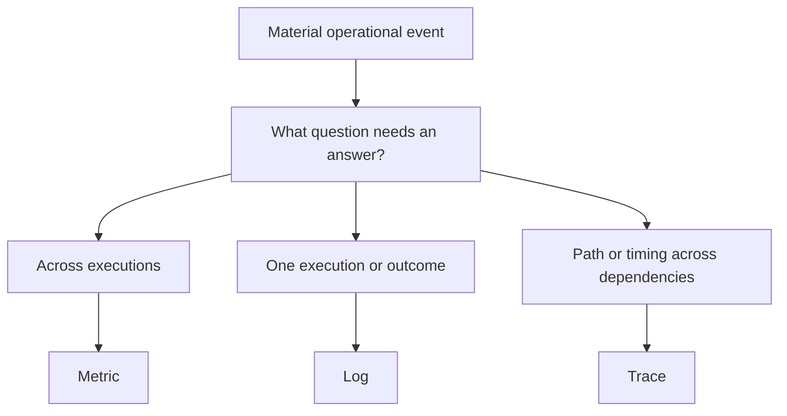

# Lambda Powertools

Start with an operational question. Add the minimum signal that answers it with safe diagnostic value and acceptable cost. Do not start by adding Logger + Metrics + Tracer.

## Decide before coding

Evaluate branches independently. A trace can be useful without a log. A log does not require a metric or trace. No new signal is a valid decision when managed AWS telemetry already answers the question.

1. Inspect existing telemetry, Lambda trigger, dependencies, retry/ack behavior, and Powertools versions. Reuse the existing signal owner.
2. Write a short decision record: question, operational action/owner, existing coverage, selected signal or omission, emission boundary, safe fields/dimensions, and volume estimate. Read [signal-selection](references/signal-selection.md) if uncertain.
3. For a metric, select exactly one purpose: `outcome`, `latency`, `load`, `resource`, or `correctness`. Require aggregate meaning, bounded dimensions, and value greater than metric + EMF/log + cardinality + maintenance cost. Read [metrics](references/metrics.md) before using Metrics.
4. For a log, choose a material outcome and its failure-category contract. Require operation, stage, class, specific safe rule/reason, location or dependency, and correlation where applicable. Read [logging](references/logging.md), [diagnostic sufficiency](references/diagnostic-sufficiency.md), and [failure taxonomy](references/failure-taxonomy.md) before adding a failure event.
5. For a trace, name the path/timing question that logs or metrics cannot answer. Use meaningful dependency/workflow boundaries. Read [tracing](references/tracing.md) before enabling Tracer; verify capture defaults and transport support.
6. Put emissions at Lambda/request, workflow, dependency, retry, queue/batch, or fallback boundaries. Keep one owner per outcome; aggregate loops. Read [Lambda surfaces](references/lambda-surfaces.md).
7. Use Powertools directly. Do not introduce a competing logger or import the root OTel definitions/emitter. Initialize selected utilities outside the handler; reset invocation state and use one metric publication owner.
8. Review [cost and noise](references/cost-and-noise.md), then apply the [review rubric](references/review-rubric.md) and [enforcement guidance](references/enforcement.md). Report what was deliberately omitted and why.

## Hard rules

- Never log raw events/bodies/headers, tokens, credentials, arbitrary errors, or unrestricted exception messages/stacks. Apply the same privacy rule to trace metadata and EMF metadata.
- Use fixed event names/messages and allowlisted bounded diagnostic values. Generic `invalid_input` alone is insufficient.
- Do not narrate internal steps at INFO or add metrics/subsegments for trivial helpers.
- Do not duplicate Lambda/AWS metrics, terminal logs, SDK subsegments, or metric publication. Metrics are classic CloudWatch EMF, not native OTLP/PromQL.
- Do not load the root `cloudwatch-instrumentation` contract for this scope. Powertools Tracer uses X-Ray; the root skill requires OTel. Select one architecture for a workload.
- Keep business outcomes intact if telemetry fails. Do not sample exact outcome/resource totals. Hard timeouts can bypass cleanup; use managed Lambda telemetry for them.

## Load only what the task needs

| Need | Read |
| --- | --- |
| Scope and invariants | [charter](references/charter.md) |
| Signal choice and omissions | [signal-selection](references/signal-selection.md) |
| Aggregate contracts and EMF publication | [metrics](references/metrics.md) |
| Material log events and safe Powertools use | [logging](references/logging.md) |
| Failure-specific required fields | [diagnostic-sufficiency](references/diagnostic-sufficiency.md), [failure-taxonomy](references/failure-taxonomy.md) |
| Dependency paths, timing, and async limits | [tracing](references/tracing.md) |
| Handler, retry, batch, fallback ownership | [lambda-surfaces](references/lambda-surfaces.md) |
| Cost review | [cost-and-noise](references/cost-and-noise.md) |
| Review and verification | [review-rubric](references/review-rubric.md), [enforcement](references/enforcement.md) |
| Logger only; no custom metric or trace | [validation-handler.ts](examples/typescript/src/validation-handler.ts) |
| Metrics only; batch fallback ratio | [batch-metrics.ts](examples/typescript/src/batch-metrics.ts) |
| Tracer and one diagnostic log; no custom metric | [dependency-handler.ts](examples/typescript/src/dependency-handler.ts) |
